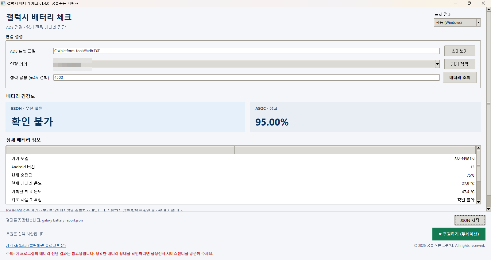

# Galaxy Battery Check

**v1.4.3 | Windows | Python | ADB | Unofficial**

[English](#english) | [한국어](#한국어)



*Actual application screenshot on Windows. Displayed values depend on the connected device and firmware.*

---

## English

Galaxy Battery Check is an unofficial Windows utility that displays battery information reported by Samsung Galaxy devices through ADB (Android Debug Bridge).

It can display BSOH, ASOC, charge cycles, battery temperature, and other available data, with an option to save results as JSON. Root access is not required.

> **Unofficial software**
>
> This project is independently developed and is not affiliated with, endorsed, certified, or sponsored by Samsung Electronics. It is not a substitute for Samsung's official battery diagnostics.

### Features

- **BSOH and ASOC:** Displays reported values when available. Unsupported or inaccessible fields are shown as unavailable.
- **Battery details:** Shows available data such as charge level, temperature, recorded maximum temperature, first-use date, and charge cycle count.
- **Capacity estimates:** Uses an optional rated capacity (mAh) and available battery data to produce rough reference estimates, not measured battery capacity.
- **ADB device selection:** Supports selecting an ADB executable and discovering connected devices.
- **JSON export:** Saves collected information to a JSON file.
- **Multilingual GUI:** Korean, English, and Japanese, with automatic Windows display-language detection and manual selection.

### Requirements and Downloads

| Component | Required? | Official Download |
| --- | --- | --- |
| Windows 10 / Windows 11 | Yes | — |
| Python 3.10 or later, including Tkinter | Yes | [Python.org](https://www.python.org/downloads/) |
| Android SDK Platform-Tools (ADB) | Yes | [Android Developers](https://developer.android.com/tools/releases/platform-tools) |
| Samsung Android USB Driver for Windows | If Windows does not recognize the phone | [Samsung Developer](https://developer.samsung.com/android-usb-driver) |
| Samsung Galaxy phone and USB data cable | Yes | — |

This repository provides the **Python source version**. It does not include a standalone Windows executable or `adb.exe`.

Android Studio, root access, and additional third-party Python packages are not required.

### Installation and Setup (Windows)

**1. Install Python**

1. Visit the [official Python downloads page](https://www.python.org/downloads/) and install Python for Windows.
2. Make sure Python 3.10 or later is installed.
3. Open PowerShell and verify the installation.

```powershell
python --version
python -m tkinter
```

The Tkinter command should open a small test window.

**2. Install Android SDK Platform-Tools (ADB)**

1. Visit the [official Android SDK Platform-Tools page](https://developer.android.com/tools/releases/platform-tools).
2. Select **Download SDK Platform-Tools for Windows**.
3. Extract the downloaded ZIP file.
4. Locate `adb.exe`, for example:

```text
C:\platform-tools\adb.exe
```

Verify ADB from PowerShell:

```powershell
& "C:\platform-tools\adb.exe" version
```

Adding ADB to the system PATH is optional because Galaxy Battery Check allows you to select the executable directly.

**3. Enable USB Debugging**

On your Samsung Galaxy device:

1. Open **Settings → About phone → Software information**.
2. Tap **Build number** seven times.
3. Enter your device credentials if prompted.
4. Open **Settings → Developer options**.
5. Enable **USB debugging**.
6. Connect the phone to your PC using a USB data cable.
7. Approve the USB debugging authorization prompt on the phone.

**4. Verify the ADB Connection**

Open PowerShell and run:

```powershell
& "C:\platform-tools\adb.exe" devices
```

Possible results:

- `device` — Device connected and authorized.
- `unauthorized` — Approve USB debugging on the phone.
- No device listed — Check the USB cable, USB port, and drivers.

If Windows cannot recognize the phone, install the [Samsung Android USB Driver for Windows](https://developer.samsung.com/android-usb-driver).

**5. Run Galaxy Battery Check**

1. Download the project files from GitHub.
2. Extract the files into the same directory.
3. Double-click `galaxy battery check.pyw`.
4. Select the location of `adb.exe` in the application.
5. Find and select the connected Samsung Galaxy device.
6. Run the battery information query.
7. Save the results as JSON if needed.

Alternatively, start the GUI using PowerShell:

```powershell
pythonw "galaxy battery check.pyw"
```

### Command-Line Usage

The application also provides a command-line interface.

Display version information:

```powershell
python "galaxy battery check.py" --version
```

Display battery information in JSON format:

```powershell
python "galaxy battery check.py" --json
```

Save a battery report:

```powershell
python "galaxy battery check.py" --save "battery report.json"
```

Use `--adb` to specify the ADB executable and `--serial` to select a device when multiple devices are connected.

The included `create desktop shortcut.cmd` can create a desktop shortcut for launching the Python application.

### BSOH and ASOC Limitations

Galaxy Battery Check primarily retrieves battery information using:

```powershell
adb shell dumpsys battery
```

The tool attempts to read fields including:

```text
mSavedBatteryBsoh
mSavedBatteryAsoc
```

The availability of these values depends on the device model, Android version, Samsung One UI version, and firmware.

This includes One UI 7 devices.

If BSOH is not reported by the device, the application displays an unavailable status instead of generating an artificial BSOH value.

**BSOH and ASOC are different indicators and should not be treated as equivalent measurements.**

The information displayed by this application is intended for reference and does not replace official battery diagnostics.

### Troubleshooting

If the GUI does not open, verify Python and Tkinter.

To view Python startup errors, run:

```powershell
python "galaxy battery gui.py"
```

If the device is not detected, verify its ADB connection and USB debugging authorization.

### Release File and Checksums

The following information applies specifically to:

**GalaxyBatteryCheck v1.4.3 Unofficial.zip**

| Item | Value |
| --- | --- |
| File size | 160,110 bytes |
| MD5 | `913215e82baae2d2c1e5e69067fccf27` |
| SHA-1 | `bae73577aef5d6ef0277ce5e9dcea5e0fdc9edd8` |
| SHA-256 | `fe049082707e95be2a265458847000bf14c2323ef2720745bfd04464fad0b0e9` |

Verify the SHA-256 checksum using PowerShell:

```powershell
Get-FileHash -Algorithm SHA256 ".\GalaxyBatteryCheck v1.4.3 Unofficial.zip"
```

These checksums do not apply to GitHub's automatically generated source archives.

**VirusTotal Analysis**

[View the file analysis on VirusTotal](https://www.virustotal.com/gui/file/fe049082707e95be2a265458847000bf14c2323ef2720745bfd04464fad0b0e9/details)

VirusTotal scan results are provided for reference and do not guarantee that a file is free from malicious software.

### Support

Galaxy Battery Check is independently developed and maintained.

- Developer: **Sakai**
- Blog: https://wezard4u.tistory.com/
- Toonation: https://toon.at/donate/637833976686140024
- Ko-fi: https://ko-fi.com/sakai38666

Donations are entirely optional.

#### ☕ Support Independent Development & Security Research

In addition to developing and maintaining Galaxy Battery Check, I independently research malware, phishing websites, malicious scripts, suspicious files, and other cybersecurity threats.

My technical research and findings are shared through [WEZARD4U'S BLOG](https://wezard4u.tistory.com/).

My work includes analyzing suspicious files, investigating phishing infrastructure, documenting technical findings, and sharing information that may help improve cybersecurity awareness.

I also contribute to Korean localization of open-source software when time permits.

Maintaining these activities requires development and analysis tools, testing environments, storage, technical documentation, and ongoing maintenance.

If Galaxy Battery Check or my cybersecurity research has been useful to you, you can support my independent work.

<a href="https://ko-fi.com/sakai38666">
  
</a>

☕ **Ko-fi:** [Support My Research](https://ko-fi.com/sakai38666)

💛 **Toonation:** [Support via Toonation](https://toon.at/donate/637833976686140024)

For more information about supporting my work:

🌐 [Support Independent Malware & Phishing Analysis — WEZARD4U'S BLOG](https://wezard4u.tistory.com/6259)

Even a small contribution helps support software development, maintenance, cybersecurity research, analysis environments, and technical documentation.

Support is completely optional.

Galaxy Battery Check remains available regardless of donations. My regular security analysis and technical articles will also continue to be shared publicly.

Reading, sharing, or recommending my work is also greatly appreciated.

Thank you for your support.

### Copyright and Disclaimer

**© 2026 꿈을꾸는 파랑새. All rights reserved.**

Samsung and Galaxy are trademarks of Samsung Electronics.

This application is an independent utility and is not affiliated with Samsung Electronics.

Battery diagnostic results are provided for informational purposes only. For an accurate assessment, please contact Samsung Support or a Samsung-authorized repair provider.

No open-source license has been granted. Public access to the source code does not automatically grant permission for modification, redistribution, or commercial use.

See `NOTICE.txt` for additional information.

---

## 한국어

Galaxy Battery Check는 삼성 갤럭시 스마트폰이 ADB(Android Debug Bridge)를 통해 제공하는 배터리 정보를 확인할 수 있도록 제작한 Windows용 비공식 프로그램입니다.

BSOH, ASOC, 충전 사이클, 배터리 온도 등의 정보를 조회하고 결과를 JSON 파일로 저장할 수 있습니다.

루트 권한은 필요하지 않습니다.

> **비공식 프로그램 안내**
>
> 이 프로그램은 개인 개발자가 제작한 소프트웨어로, 삼성전자와 제휴하거나 삼성전자로부터 승인·인증·후원을 받은 제품이 아닙니다. 삼성전자의 공식 배터리 진단을 대체하지 않습니다.

### 주요 기능

- **BSOH / ASOC 조회:** 기기에서 제공하는 값을 표시하며, 조회할 수 없는 항목은 `확인 불가`로 처리합니다.
- **배터리 정보:** 충전량, 배터리 온도, 기록된 최고 온도, 최초 사용 기록일, 충전 사이클 등 확인 가능한 정보를 표시합니다.
- **배터리 용량 참고값:** 정격 용량(mAh)과 이용 가능한 배터리 데이터를 바탕으로 간이 추정값을 계산합니다. 실제 측정한 배터리 용량이 아닙니다.
- **ADB 기기 검색:** 연결된 기기를 검색하고 사용할 기기를 선택할 수 있습니다.
- **JSON 저장:** 조회 결과를 JSON 파일로 저장할 수 있습니다.
- **다국어 지원:** 한국어, 영어, 일본어를 지원하며 Windows 표시 언어 자동 감지와 수동 변경 기능을 제공합니다.

### 실행 환경 및 필요한 프로그램

| 항목 | 필요 여부 | 공식 다운로드 |
| --- | --- | --- |
| Windows 10 / Windows 11 | 필수 | — |
| Python 3.10 이상 (Tkinter 포함) | 필수 | [Python 공식 사이트](https://www.python.org/downloads/) |
| Android SDK Platform-Tools (ADB) | 필수 | [Google 공식 사이트](https://developer.android.com/tools/releases/platform-tools) |
| Samsung Android USB Driver | 기기 인식에 문제가 있을 때 | [Samsung Developer](https://developer.samsung.com/android-usb-driver) |
| 삼성 갤럭시 스마트폰 및 USB 데이터 케이블 | 필수 | — |

이 저장소에서는 Python 소스 코드 버전을 제공합니다.

독립 실행형 Windows EXE 파일과 ADB 실행 파일은 포함되어 있지 않습니다.

Android Studio 전체 설치와 스마트폰 루팅은 필요하지 않습니다.

### 설치 및 실행 방법

**1. Python 설치**

1. [Python 공식 다운로드 페이지](https://www.python.org/downloads/)에 접속합니다.
2. Windows용 Python 3.10 이상을 설치합니다.
3. PowerShell을 실행하여 설치 상태를 확인합니다.

```powershell
python --version
python -m tkinter
```

Tkinter가 정상 설치되어 있다면 테스트 창이 열립니다.

**2. Android SDK Platform-Tools 설치**

1. [Android SDK Platform-Tools 공식 사이트](https://developer.android.com/tools/releases/platform-tools)에 접속합니다.
2. Windows용 Platform-Tools ZIP 파일을 다운로드합니다.
3. 파일을 원하는 위치에 압축 해제합니다.
4. 압축 해제한 폴더에서 `adb.exe`를 확인합니다.

예시 경로:

```text
C:\platform-tools\adb.exe
```

PowerShell에서 버전을 확인합니다.

```powershell
& "C:\platform-tools\adb.exe" version
```

Galaxy Battery Check에서는 ADB 실행 파일의 경로를 직접 지정할 수 있으므로 환경 변수 PATH 설정은 필수가 아닙니다.

**3. 갤럭시 스마트폰 USB 디버깅 활성화**

1. **설정 → 휴대전화 정보 → 소프트웨어 정보**로 이동합니다.
2. **빌드번호**를 7번 연속 누릅니다.
3. **설정 → 개발자 옵션**으로 이동합니다.
4. **USB 디버깅**을 활성화합니다.
5. USB 데이터 케이블로 PC와 연결합니다.
6. 스마트폰에 표시되는 USB 디버깅 허용 요청을 승인합니다.

**4. ADB 연결 확인**

PowerShell에서 다음 명령어를 실행합니다.

```powershell
& "C:\platform-tools\adb.exe" devices
```

연결 상태에 따라 다음 결과가 표시됩니다.

- `device` — 정상 연결
- `unauthorized` — USB 디버깅 승인 필요
- 기기가 표시되지 않음 — USB 케이블, 포트, 드라이버 점검 필요

Windows에서 기기를 제대로 인식하지 못한다면 [Samsung Android USB Driver](https://developer.samsung.com/android-usb-driver)를 설치한 후 다시 연결합니다.

**5. Galaxy Battery Check 실행**

1. GitHub에서 프로젝트 파일을 다운로드합니다.
2. 소스 파일을 동일한 폴더에 압축 해제합니다.
3. `galaxy battery check.pyw` 파일을 실행합니다.
4. GUI에서 `adb.exe` 경로를 지정합니다.
5. 연결된 갤럭시 스마트폰을 검색하고 선택합니다.
6. 배터리 정보 조회 기능을 실행합니다.
7. 필요한 경우 JSON 파일로 저장합니다.

PowerShell에서 직접 실행할 수도 있습니다.

```powershell
pythonw "galaxy battery check.pyw"
```

### 명령줄 실행 방법

버전 확인:

```powershell
python "galaxy battery check.py" --version
```

배터리 정보를 JSON 형식으로 출력:

```powershell
python "galaxy battery check.py" --json
```

배터리 정보를 파일로 저장:

```powershell
python "galaxy battery check.py" --save "battery report.json"
```

`--adb` 옵션으로 ADB 실행 파일 경로를 지정할 수 있으며, 여러 기기가 연결되어 있다면 `--serial` 옵션을 사용해 대상 기기를 선택할 수 있습니다.

### One UI 및 BSOH / ASOC 관련 사항

프로그램은 주로 다음 명령어에서 배터리 관련 정보를 조회합니다.

```powershell
adb shell dumpsys battery
```

조회하는 주요 항목에는 다음 값이 포함됩니다.

```text
mSavedBatteryBsoh
mSavedBatteryAsoc
```

One UI 7을 포함하여 스마트폰 모델, Android 버전, One UI 버전 및 펌웨어에 따라 반환되는 정보가 다를 수 있습니다.

BSOH 값이 제공되지 않는 경우 프로그램은 해당 값을 임의로 생성하지 않으며 `확인 불가`로 표시합니다.

BSOH와 ASOC는 서로 다른 배터리 상태 지표이므로 동일한 값이나 의미로 해석해서는 안 됩니다.

### 문제 해결

프로그램 실행 시 GUI 창이 열리지 않는다면 다음 명령어로 오류를 확인할 수 있습니다.

```powershell
python "galaxy battery gui.py"
```

기기가 인식되지 않는 경우 USB 디버깅 허용 여부와 ADB 연결 상태를 확인해야 합니다.

### 배포 파일 및 해시값

배포 파일:

**GalaxyBatteryCheck v1.4.3 Unofficial.zip**

| 항목 | 값 |
| --- | --- |
| 파일 크기 | 160,110바이트 |
| MD5 | `913215e82baae2d2c1e5e69067fccf27` |
| SHA-1 | `bae73577aef5d6ef0277ce5e9dcea5e0fdc9edd8` |
| SHA-256 | `fe049082707e95be2a265458847000bf14c2323ef2720745bfd04464fad0b0e9` |

PowerShell에서 SHA-256 검증:

```powershell
Get-FileHash -Algorithm SHA256 ".\GalaxyBatteryCheck v1.4.3 Unofficial.zip"
```

위 해시값은 해당 배포 ZIP에만 적용됩니다.

**VirusTotal 분석 결과**

[Galaxy Battery Check v1.4.3 VirusTotal 결과 확인](https://www.virustotal.com/gui/file/fe049082707e95be2a265458847000bf14c2323ef2720745bfd04464fad0b0e9/details)

VirusTotal 분석 결과는 참고 자료이며 프로그램의 안전성을 완전히 보증하는 것은 아닙니다.

### 후원

Galaxy Battery Check는 개인 개발자가 독립적으로 개발하고 유지보수하는 프로그램입니다.

- 제작자: **Sakai (꿈을꾸는 파랑새)**
- 블로그: https://wezard4u.tistory.com/
- 투네이션: https://toon.at/donate/637833976686140024
- Ko-fi: https://ko-fi.com/sakai38666

후원은 선택 사항이며 프로그램 사용에 영향을 주지 않습니다.

#### 💙 독립적인 개발 및 보안 연구 후원

저는 Galaxy Battery Check 개발 외에도 악성코드, 피싱 사이트, 악성 스크립트, 의심스러운 파일 등 실제 사이버 위협을 직접 분석하고 있습니다.

분석 과정에서 확인한 기술적인 내용은 [꿈을꾸는 파랑새 블로그](https://wezard4u.tistory.com/)를 통해 공유하고 있습니다.

단순히 악성 여부를 확인하는 것에 그치지 않고 가능한 범위에서 악성코드의 동작 방식, 피싱 사이트 구조, 악성 스크립트 실행 과정, 침해 지표 및 관련 네트워크 인프라 등을 살펴보고 있습니다.

또한 시간이 허락할 때는 오픈소스 소프트웨어의 한국어 번역과 현지화 작업에도 참여하고 있습니다.

이러한 개발과 분석 활동을 지속하기 위해서는 개발 도구, 분석 소프트웨어, 테스트 환경, 분석 자료 저장 공간 및 기술 문서 작성 등에 비용이 발생합니다.

Galaxy Battery Check나 제 보안 분석 글이 도움이 되셨다면 자발적인 후원을 통해 활동을 응원해 주실 수 있습니다.

#### 💙 카카오페이로 응원하기


📱 카카오톡 또는 카카오페이에서 위 QR 코드를 스캔하여 후원하실 수 있습니다.

#### ☕ Ko-fi 및 투네이션으로 응원하기

- ☕ **Ko-fi:** [https://ko-fi.com/sakai38666](https://ko-fi.com/sakai38666)
- 💛 **투네이션:** [https://toon.at/donate/637833976686140024](https://toon.at/donate/637833976686140024)

#### 🔬 후원금 활용

보내주시는 후원은 다음과 같은 활동에 도움이 됩니다.

- 💻 Galaxy Battery Check 개발 및 유지보수
- 🔬 보안 분석 및 조사
- 🦠 악성코드 분석
- 🎣 피싱 사이트 분석
- 📜 악성 스크립트 분석
- 🧰 개발 도구 및 분석 소프트웨어
- 🖥️ 개발 및 보안 분석 환경 유지
- 💾 분석 자료 및 저장 공간
- 🌐 블로그 운영
- 📝 기술 자료 작성
- 🌏 오픈소스 소프트웨어 한국어 현지화

후원 금액의 크기는 중요하지 않습니다.

커피나 음료 한 잔 정도의 작은 응원도 독립적인 개발과 보안 연구 활동을 계속하는 데 도움이 됩니다.

자세한 후원 안내는 블로그에서도 확인하실 수 있습니다.

🌐 [후원 안내 — 꿈을꾸는 파랑새](https://wezard4u.tistory.com/6259)

**후원은 완전히 선택 사항이며, 후원 여부와 관계없이 Galaxy Battery Check 사용에 제한이 발생하지 않습니다.**

일반적인 보안 분석 글과 기술 정보 역시 계속 공개할 예정입니다.

금전적인 후원 외에도 프로그램을 사용해 주시거나 블로그 글을 읽고 필요한 사람에게 공유해 주시는 것만으로도 큰 도움이 됩니다.

감사합니다. 💙

### 저작권 및 면책 안내

**© 2026 꿈을꾸는 파랑새. All rights reserved.**

Samsung 및 Galaxy는 삼성전자의 상표입니다.

본 프로그램은 삼성전자와 관계없이 독립적으로 제작한 비공식 소프트웨어입니다.

프로그램에서 제공하는 배터리 진단 정보는 참고용이며, 정확한 배터리 상태 확인이 필요한 경우 삼성전자 공식 서비스센터 또는 해당 지역의 공식 지원·수리 창구를 이용하시기 바랍니다.

별도의 오픈소스 라이선스는 부여하지 않았으며, 소스 코드가 공개되어 있다는 사실만으로 수정·재배포·상업적 사용 권한이 허용되는 것은 아닙니다.

자세한 내용은 `NOTICE.txt`를 참고하시기 바랍니다.
